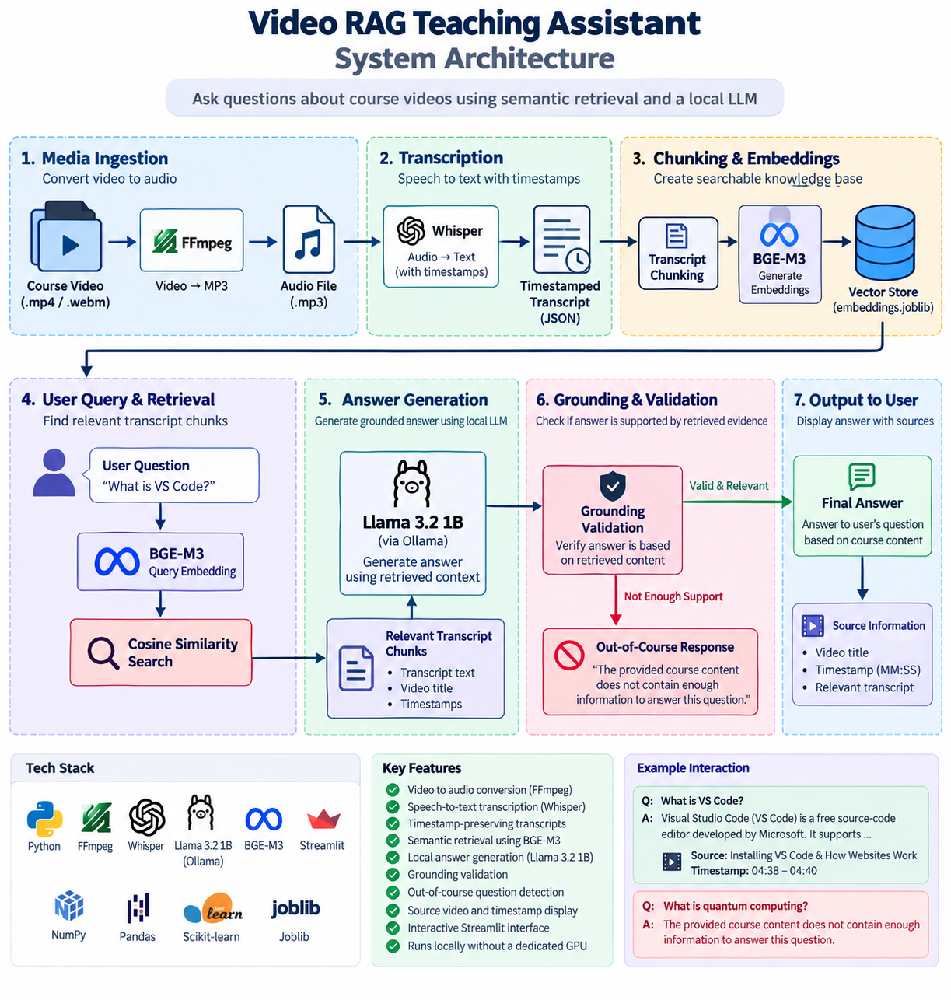
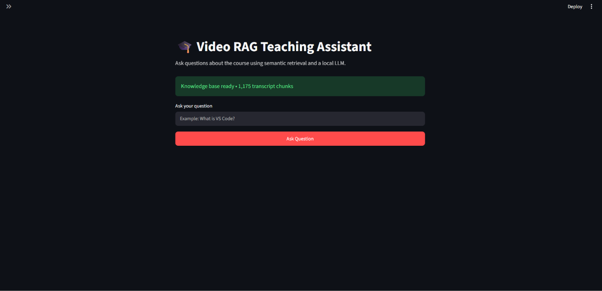
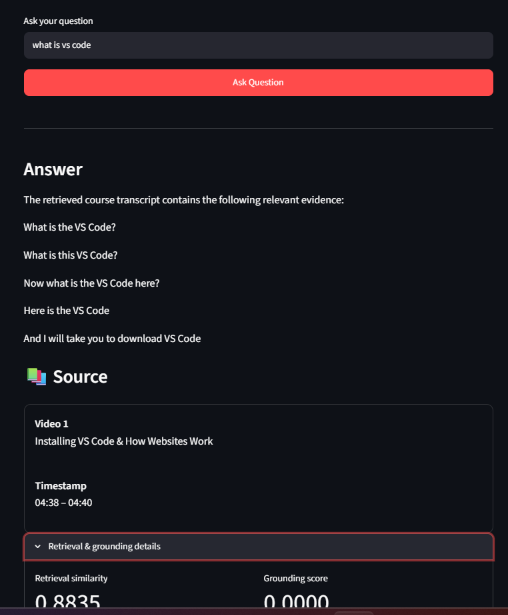
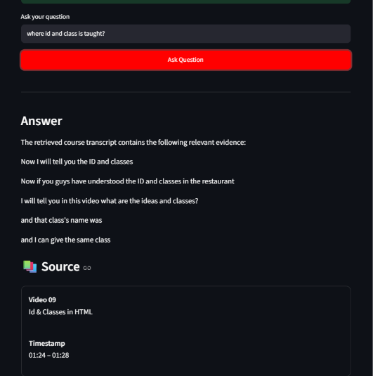
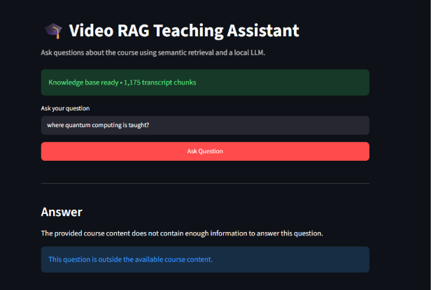

# 🎓 Video RAG Teaching Assistant

A resource-efficient **Retrieval-Augmented Generation (RAG)** system that allows users to ask questions about course videos and receive answers grounded in timestamped video transcripts.

The system converts video/audio content into transcripts, creates semantic embeddings, retrieves relevant transcript chunks, and uses a local Large Language Model to generate grounded responses.

---

## 🚀 Features

- 🎥 Video-to-audio conversion using FFmpeg
- 🎙️ Speech-to-text transcription using OpenAI Whisper
- ⏱️ Timestamp-preserving transcripts
- 🧩 Transcript chunking
- 🔎 Semantic retrieval using BGE-M3 embeddings
- 📐 Cosine similarity-based retrieval
- 🤖 Local answer generation using Llama 3.2 1B
- 🛡️ Grounding validation for generated answers
- 🚫 Out-of-course question detection
- 📚 Source video and timestamp display
- 🌐 Interactive Streamlit interface
- 💻 Designed to run locally without a dedicated NVIDIA GPU

---

## 🧠 System Architecture



```text
                    VIDEO / AUDIO
                         │
                         ▼
                ┌─────────────────┐
                │     FFmpeg      │
                │ Video → MP3     │
                └────────┬────────┘
                         │
                         ▼
                ┌─────────────────┐
                │     Whisper     │
                │ Speech → Text   │
                └────────┬────────┘
                         │
                         ▼
              Timestamped JSON
                         │
                         ▼
                ┌─────────────────┐
                │     Chunking    │
                └────────┬────────┘
                         │
                         ▼
                ┌─────────────────┐
                │     BGE-M3      │
                │   Embeddings    │
                └────────┬────────┘
                         │
                         ▼
                 embeddings.joblib
                         │
                         │
                  USER QUESTION
                         │
                         ▼
                ┌─────────────────┐
                │     BGE-M3      │
                │ Query Embedding │
                └────────┬────────┘
                         │
                         ▼
                Cosine Similarity
                         │
                         ▼
                 Relevant Chunks
                         │
                         ▼
                ┌─────────────────┐
                │  Llama 3.2 1B  │
                │ Answer Generation│
                └────────┬────────┘
                         │
                         ▼
                Grounding Validation
                         │
                         ▼
                 Answer + Source
                  + Timestamp


---

## 🖥️ Application Screenshots

### Application Interface



### RAG Answer with Source and Timestamp



### Course Question



### Out-of-Course Question Detection

